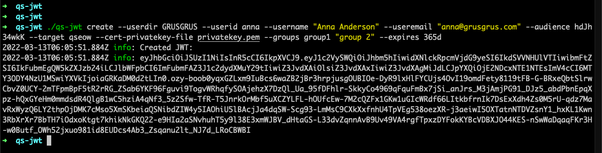
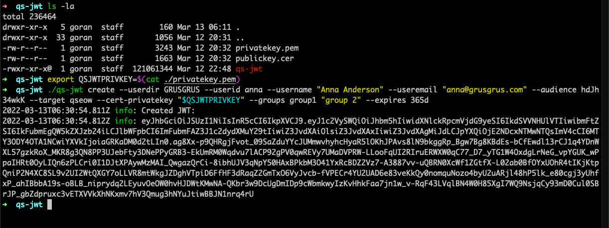
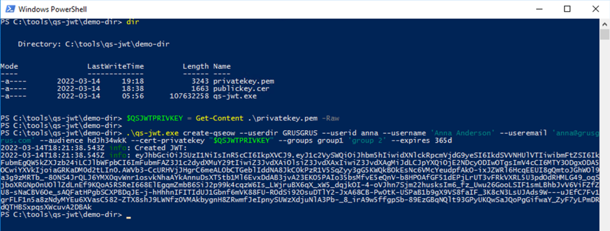
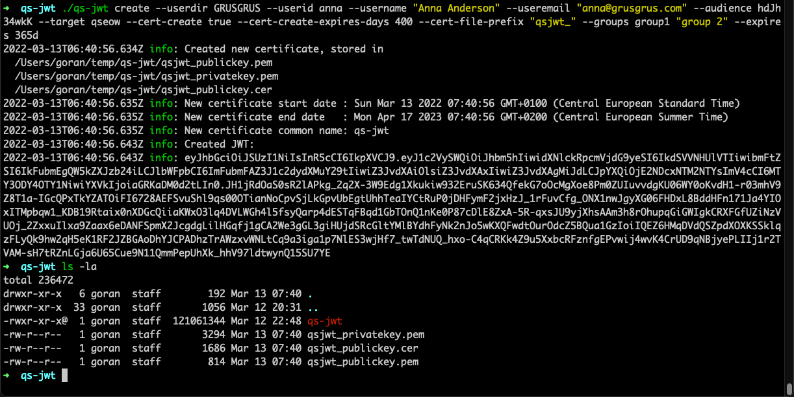
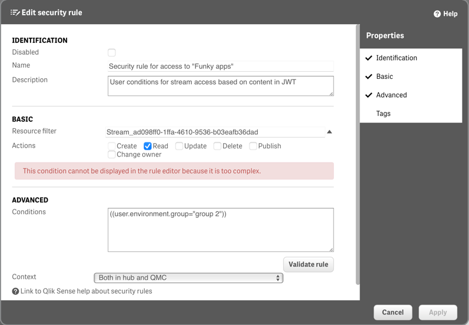

<h1 align="center">QS-JWT</h1>
<h3 align="center">Easily create Qlik Sense JWTs</h3>
<p align="center">
<a href="https://github.com/ptarmiganlabs/qs-jwt">
</a>
<a href="https://github.com/ptarmiganlabs/qs-jwt/actions/workflows/release-please.yml"></a>
</p>

A cross platform, command line tool for creating JWTs (=JSON Web Tokens) that can be used to authenticate with Qlik Sense.  
qs-jwt is available on Windows, Linux and macOS.

Currently JWTs for Qlik Sense Enterprise on Windows (QSEoW) can be created.  
Support for Qlik Sense Cloud JWTs coming soon.

qs-jwt nicely complements the more operationally focused open source tools in the [Butler family](https://github.com/ptarmiganlabs).  
Those tools focus on things such as real-time monitoring of client-managed Qlik Sense environments, flexible and powerful alerts/notifications when reloads fail, automatically creating sheet thumbnails and much more. More info at [https://github.com/ptarmiganlabs](https://github.com/ptarmiganlabs).

<h2>Table of contents</h2>

- [Introduction](#introduction)
  - [JWT pros and cons](#jwt-pros-and-cons)
  - [Online JWT resources](#online-jwt-resources)
  - [What is qs-jwt](#what-is-qs-jwt)
- [Install](#install)
- [qs-jwt concepts](#qs-jwt-concepts)
  - [Command line tool](#command-line-tool)
  - [JWT claims](#jwt-claims)
- [Commands](#commands)
  - ["create-qseow" command](#create-qseow-command)
- [Modes of operation](#modes-of-operation)
  - [QSEoW: Create JWTs using existing certificate and private key files](#qseow-create-jwts-using-existing-certificate-and-private-key-files)
    - [Create a certificate using openssl](#create-a-certificate-using-openssl)
    - [Running on macOS](#running-on-macos)
    - [Running on Windows Server 2016](#running-on-windows-server-2016)
  - [QSEoW: Create JWTs using existing certificate and private passed as parameters](#qseow-create-jwts-using-existing-certificate-and-private-passed-as-parameters)
    - [Running on macOS](#running-on-macos-1)
    - [Running on Windows Server 2016](#running-on-windows-server-2016-1)
  - [QSEoW: Create new certificate and key pair, then create JWT](#qseow-create-new-certificate-and-key-pair-then-create-jwt)
    - [Running on macOS](#running-on-macos-2)
    - [Running on Windows Server 2016](#running-on-windows-server-2016-2)
- [Using JWTs in security rules](#using-jwts-in-security-rules)
- [Logging](#logging)
- [Security and disclosure](#security-and-disclosure)
  - [Platform specific security information](#platform-specific-security-information)

---

# Introduction

JSON Web Tokens (JWTs) is a way to authenticate API access. It can be used for other kinds of authentication as well, but with respect to Qlik Sense the API auth use case is the most relevant one.

**Note that JWTs (when used with Qlik Sense) contain unencrypted information about users and provide access to the Qlik Sense system.  
In other words: Qlik Sense JWTs should be treated just like user IDs and password.**

[This](https://blog.logrocket.com/jwt-authentication-best-practices/) blog post nicely describes what JWTs are:

> A JWT is a mechanism to verify the owner of some JSON data. It’s an encoded, URL-safe string that can contain an unlimited amount of data (unlike a cookie) and is cryptographically signed.
>
> When a server receives a JWT, it can guarantee the data it contains can be trusted because it’s signed by the source. No middleman can modify a JWT once it’s sent.
>
> It’s important to note that a JWT guarantees data ownership but not encryption. The JSON data you store into a JWT can be seen by anyone that intercepts the token because it’s just serialized, not encrypted.
>
> For this reason, it’s highly recommended to use HTTPS with JWTs (and HTTPS in general, by the way).

So what does this mean in a Qlik Sense context?
Let's break it down a bit:

- A Qlik Sense user directory and ID is embedded in the JWT.
- Once a tool presents the JWT to a Qlik Sense API, Sense will be able to use the user dir/ID in the JWT to first authenticate the user, then also decide (using security rules) what the user should be allowed to do in Sense.
- Each JWT is configured with an expiry time. It's a good security principle to keep the expiry dates short.
- Additional metadata can be included in the JWT. Example include email address, real name, group belonging, access roles etc. This information is available in Sense security rules.
- The JWT is not encrypted, but it is cryptographically signed. This means that it's not possible to modify or tamper with the JWT once it's been created.
- JWTs can be used with both client-managed Qlik Sense (=Qlik Sense Enterprise on Windows, QSEoW) as well as Qlik Sense Cloud. The exact format vary though, so those JWTs are not interchangeable.

## JWT pros and cons

Benefits of JWTs include

- The Qlik Sense admin can control which Sense user/account is given API access and how long that access will be valid for.
- The JWT can include any metadata that will then be available in Sense security rules.
- Well-established, proven concept to provide authenticated API access.

Drawbacks of JWTs

- Once created and handed over to someone it's not possible to revoke the JWT. It will simply work until its expiry date has passed or the central certificate is changed. But that will revoke *all* JWTs created using that certificate/key.
- The revoking issue can be solved, but this requires additional software/services outside of Qlik Sense. Sense itself does not have a built-in revokation service.
- The JWT used with Qlik Sense are not encrypted. This means they can be read by anyone able to listen on the network traffic. Using https goes a long way towards solving this problem.

## Online JWT resources

- [jwt.io](https://jwt.io) is a great starting point for anything JWT related.
- [Blog post](https://blog.logrocket.com/jwt-authentication-best-practices/) explaining how JWTs can be used for authentication
- qlik.dev has good articles about [using JWTs with QSEoW](https://qlik.dev/tutorials/using-qlik-sense-on-windows-repository-api-qrs-with-qlik-cli) as well as with [Qlik Sense Cloud](https://qlik.dev/tutorials/create-signed-tokens-for-jwt-authorization).
- Qlik Sense Enterprise on Windows [help pages](https://help.qlik.com/en-US/sense-admin/February2022/Subsystems/DeployAdministerQSE/Content/Sense_DeployAdminister/QSEoW/Administer_QSEoW/Managing_QSEoW/JWT-authentication.htm) has a good description of JWT authentication within QSEoW.
- Qlik article describing how to [set up a JWT enabled virtual proxy](https://community.qlik.com/t5/Knowledge/Qlik-Sense-How-to-set-up-JWT-authentication/ta-p/1716226) in QSEoW.

## What is qs-jwt

JWTs can be created using various online tools.

This can be fine during development and testing, but in production scenarious it's not be ideal (should not be accepted - period!) to enter user credentials in some random web page.  

If limited to web based JWT tools it is also difficult or impossible to automate creation of JWTs.  
While not a problem for some it may be a showstopper for others, for example if the JWTs are created with short expiry times and/or need to be automatically recreated.

> *The core idea behind qs-jwt is to simplify JWT creation and make it easier to include JWTs in CI/CD pipelines and similar scenarios.*

# Install

qs-jwt does not need to be installed.  
It is a standalone, cross-platform executable that is just downloaded and executed.

The latest version is always available from the [download page](https://github.com/ptarmiganlabs/qs-jwt/releases).  
Make sure to check for new versions (or subscribe to updates) - new features are added and security updates applied.

# qs-jwt concepts

## Command line tool

qs-jwt is a command line tool intended to be used from scripts written in Powershell, bash or similar shells.  
Or just from the command line for one-off creation of JWTs.

Given the above focus on integration in various automation scenarios, all needed information is passed to qs-jwt as parameters and options.

There are thus - by design - no interactive prompts what so ever in qs-jwt.

## JWT claims

A JWT "claim" is a piece of information that's included in the JWT. Examples include email address, user name, group belongings and other metadata associated with user accounts.  
Claims may sound like a strange term for this, but you can think of it as metadata presented by the calling system to Qlik Sense during the API call. The fact that the JWT is signed means Sense can trust that the JWT has not been modified since it was created.

# Commands

Run `qs-jwt --help` to get a list of available commands and options  

```bash
➜  demo-dir ./qs-jwt --help
Usage: qs-jwt [options] [command]

This is a tool that creates JWTs (JSON Web Tokens) that can be used with Qlik Sense Enterprise on Windows (self-managed) as well as Qlik Sense Cloud/SaaS.
The JWTs can be used when accessing Sense APIs from third party applications and services.
JWTs are usually preferred over certuficates as JWTs embed a specific user, which means access control can be applied when JWTs are used.

Options:
  -V, --version           output the version number
  -h, --help              display help for command

Commands:
  create-qseow [options]  Create a JWT for use with client-managed Qlik Sense (a.k.a Qlik Sense Enterprise on Windows) or Qlik
                          Cloud. Use --target option to target either platform.
  help [command]          display help for command
➜  demo-dir
```

## "create-qseow" command

Purpose: To create a new JWT.  
Syntax:

```bash
➜  demo-dir ./qs-jwt create-qseow --help
Usage: qs-jwt create-qseow [options]

Create a JWT for use with client-managed Qlik Sense (a.k.a Qlik Sense Enterprise on Windows) or Qlik Cloud. Use --target option to target either platform.

Options:
  --loglevel <level>                 Logging level (choices: "error", "warning", "info", "verbose", "debug", default: "info")
  --userdir <directory>              user directory (e.g. MYDIRNAME) that will be embedded in the JWT
  --userid <userid>                  user ID (e.g. johnsmith) that will be embedded in the JWT
  --username <name>                  User name (e.g. John Smith) that will be embedded in the JWT
  --useremail <email>                Email address that will be embedded in the JWT
  --groups <groups...>               Which groups the user dir/ID embedded in the JWT should be
  --expires <time>                   Time during which the JWT will be valid. Examples: 60m (60 minutes), 48h (48 hours), 365d (365
                                     days), 5y (5 years)
  --audience <audience>              JWT audience field. Audience in JWT must match the audience defined in the QSEoW virtual proxy
                                     being used
  --cert-privatekey-file <file>      File containing private key of certificate that will be used to sign the JWT
  --cert-privatekey <privatekey>     Certificate private key of certificate that will be used to sign the JWT.
  --cert-create [true|false]         Should a new certificate be created? (choices: "true", "false", default: "false")
  --cert-file-prefix <prefix>        Prefix to place before certificate file names (default: "")
  --cert-create-expires-days <days>  Number of days the new certificate should be valid for
  -h, --help                         display help for command
➜  demo-dir
```

# Modes of operation

There are a few different variants to consider when creating JWTs for Qlik Sense:

- Will the JWT be used with client-managed Qlik Sense (=Qlik Sense Enterprise on Windows, QSEoW) or with Qlik Sense cloud? These use JWTs with slightly different structure inside.
- Do you already have a crypto certificate with an associated key pair, or do you need to create one first?

qs-jwt currently supports creating JWTs for QSEoW, but Qlik Sense Cloud support is around the corner.  
The certificate question above is handled though: qs-jwt can either use an existing certificate/key or create new ones.

## QSEoW: Create JWTs using existing certificate and private key files


If you already have a certificate with an associated private key (PEM encoded), that key can (proably) be used to sign the created JWT and the certificate used in the QSEoW virtual proxy configuration.

An example could be if Qlik Sense is running in Azure/Google Cloud/Amazon EC2 and you use their various feature for handling secrets and certificates. A certificate and key value pair can then be created and stored there and then used with qs-jwt.

You could in theory also use the certificate/key created as part of every QSEoW installation, but that is generally not recommended except for testing purposes. Much better and more flexible to have a cert/key dedicated for JWT creation and authentication.

### Create a certificate using openssl

If you want to create a certificate and a private key manually that's easy too.  
On macOS it can look like this:

```bash
➜  demo-dir ll
total 236448
-rwxr-xr-x@ 1 goran  staff   115M Mar 14 06:56 qs-jwt
➜  demo-dir
➜  demo-dir openssl genrsa -out privatekey.pem 4096
Generating RSA private key, 4096 bit long modulus
.......................................................................................................................................................................................................................................................................................................................................++
...............................................................++
e is 65537 (0x10001)
➜  demo-dir
➜  demo-dir openssl req -new -x509 -key privatekey.pem -out publickey.cer -days 1825
You are about to be asked to enter information that will be incorporated
into your certificate request.
What you are about to enter is what is called a Distinguished Name or a DN.
There are quite a few fields but you can leave some blank
For some fields there will be a default value,
If you enter '.', the field will be left blank.
-----
Country Name (2 letter code) []:.
State or Province Name (full name) []:.
Locality Name (eg, city) []:.
Organization Name (eg, company) []:.
Organizational Unit Name (eg, section) []:.
Common Name (eg, fully qualified host name) []:qs-jwt
Email Address []:.
➜  demo-dir
➜  demo-dir ll
total 236464
-rw-r--r--  1 goran  staff   3.2K Mar 14 07:00 privatekey.pem
-rw-r--r--  1 goran  staff   1.6K Mar 14 07:01 publickey.cer
-rwxr-xr-x@ 1 goran  staff   115M Mar 14 06:56 qs-jwt
➜  demo-dir
```

Doing the same on Windows is a bit tricky as openssl is not natively supported on Windows. There are however several projects that make openssl available on Windows, for example [here](https://slproweb.com/products/Win32OpenSSL.html).

### Running on macOS

This example will

- Create a JWT for Qlik Sense Enterprise on Windows (the `create-qseow` command).
- Create a JWT for user `anna` in Sense userdirectory `GRUSGRUS`. Grusgrus is a fictitious company.
- The JWT will expire in 365 days.
- The private key in file `privatekey.pem` will be used to sign the JWT.
- Set claims for useremail and username to `anna@grusgrus.com` and `Anna Anderson`, respectively.
- The audience option must match the audience specified in the Qlik Sense virtual proxy.
- Two groups are defined for this user: `group1` and `group 2`.

Command (assuming the qs-jwt binary is available in the current directory):

`./qs-jwt create-qseow --userdir GRUSGRUS --userid anna --username "Anna Anderson" --useremail "anna@grusgrus.com" --audience hdJh34wkK --cert-privatekey-file privatekey.pem --groups group1 "group 2" --expires 365d`



### Running on Windows Server 2016

This example uses a certificate and private key that were created using openssl, as describe above.

Remember: Don't forget to unblock the downloaded qs-jwt ZIP file before unzipping it. Failing to unblock it may prevent proper execution of qs-jwt.exe.

`qs-jwt.exe create-qseow --userdir GRUSGRUS --userid anna --username "Anna Anderson" --useremail "anna@grusgrus.com" --audience hdJh34wkK --cert-privatekey-file privatekey.pem --groups group1 "group 2" --expires 365d`


## QSEoW: Create JWTs using existing certificate and private passed as parameters


### Running on macOS

This example will

- Set the environment variable `QSJWTPRIVKEY` to the contents of the private key in `privatekey.pem` file.
- Create a JWT for Qlik Sense Enterprise on Windows (the `create-qseow` command).
- Create a JWT for user `anna` in Sense userdirectory `GRUSGRUS`. Grusgrus is a fictitious company.
- The JWT will expire in 365 days.
- The private key in environment variable `QSJWTPRIVKEY` will be used to sign the JWT.
- Set claims for useremail and username to `anna@grusgrus.com` and `Anna Anderson`, respectively.
- The audience option must match the audience specified in the Qlik Sense virtual proxy.
- Two groups are defined for this user: `group1` and `group 2`.

Command (assuming the qs-jwt binary is available in the current directory):

`export QSJWTPRIVKEY=$(cat ./privatekey.pem)`

`./qs-jwt create-qseow --userdir GRUSGRUS --userid anna --username "Anna Anderson" --useremail "anna@grusgrus.com" --audience hdJh34wkK --cert-privatekey "$QSJWTPRIVKEY" --groups group1 "group 2" --expires 365d`



### Running on Windows Server 2016

This example uses a certificate and private key that were created using openssl, as describe above.  
Here powershell is used to run qs-jwt, with the private key stored in an environment variable.

Remember: Don't forget to unblock the downloaded qs-jwt ZIP file before unzipping it. Failing to unblock it may prevent proper execution of qs-jwt.exe.

`$QSJWTPRIVKEY = Get-Content .\privatekey.pem -Raw`

`.\qs-jwt.exe create-qseow --userdir GRUSGRUS --userid anna --username 'Anna Anderson' --useremail 'anna@grusgrus.com' --audience hdJh34wkK --cert-privatekey "$QSJWTPRIVKEY" --groups group1 'group 2' --expires 365d`



## QSEoW: Create new certificate and key pair, then create JWT


If you **do not** have a certificate with associated private key (PEM encoded) qs-jwt can create these for you.  
You will get a full public-private key pair rather than just the private key (which is what qs-jwt uses).

The created certificate and keys will be stored on disk as `privatekey.pem`, `publickey.pem` and `publickey.cer`.  
An optional prefix can be added to the file names, this is done by using the `--cert-file-prefix`  option.

### Running on macOS

This example will

- Create a JWT for Qlik Sense Enterprise on Windows (the `create-qseow` command).
- Create a JWT for user `anna` in Sense userdirectory `GRUSGRUS`. Grusgrus is a fictitious company.
- The JWT will expire in 365 days.
- A new private/public key pair will be created, as well as a new certificate based on that private key.
- The created files will be prefixed with `qsjwt_`.
- The created certificate will expire in 400 days.
- The newly created private key will be used to sign the JWT.
- Set claims for useremail and username to `anna@grusgrus.com` and `Anna Anderson`, respectively.
- The audience option must match the audience specified in the Qlik Sense virtual proxy.
- Two groups are defined for this user: `group1` and `group 2`.

Command (assuming the qs-jwt binary is available in the current directory):

`./qs-jwt create-qseow --userdir GRUSGRUS --userid anna --username "Anna Anderson" --useremail "anna@grusgrus.com" --audience hdJh34wkK --cert-create true --cert-create-expires-days 400 --cert-file-prefix "qsjwt_" --groups group1 "group 2" --expires 365d`



### Running on Windows Server 2016

Here cmd.exe is used to run qs-jwt, Powershell works equally well.

Remember: Don't forget to unblock the downloaded qs-jwt ZIP file before unzipping it. Failing to unblock it may prevent proper execution of qs-jwt.exe.

`.\qs-jwt.exe create-qseow --userdir GRUSGRUS --userid anna --username "Anna Anderson" --useremail "anna@grusgrus.com" --audience hdJh34wkK --cert-create true --cert-create-expires-days 400 --cert-file-prefix "qsjwt_" --groups group1 "group 2" --expires 365d`


# Using JWTs in security rules

Any claim embedded in the JWT can be used in QSEoW security rules.

The claims are available as `user.environment.<claim name>` in the security rules.  
You must write the security rule manually in the Conditions text box (i.e. the authoring tool doesn't work for JWT claims).

A rule that gives access to a specific stream for all JWTs where the `group` claim is "group 2" can look like this:



# Logging

Possible logging levels are `error`, `warning`, `info`, `verbose`, `debug`.

Default logging level is `info`

# Security and disclosure

qs-jwt is open source and you have access to all source code.  
It is *your own* responsibility to determine if qs-jwt is suitable for *your* use case.  
The creators of qs-jwt, including Ptarmigan Labs, Göran Sander or any other contributor, can and must never be held liable to past or future security issues of qs-jwt.  
If you have security concerns or ideas around qs-jwt, please get involved in the project and contribute to making it better!

> If you discover a serious bug with qs-jwt that may pose a security problem, please disclose it confidentially to security@ptarmiganlabs.com first, so it can be assessed and hopefully fixed prior to being exploited. Please do not raise GitHub issues for security-related doubts or problems.

## Platform specific security information

The macOS version is signed and notarized by Apple's standard process.  
A warning may still be shown first time the app is started, but that is normal.
